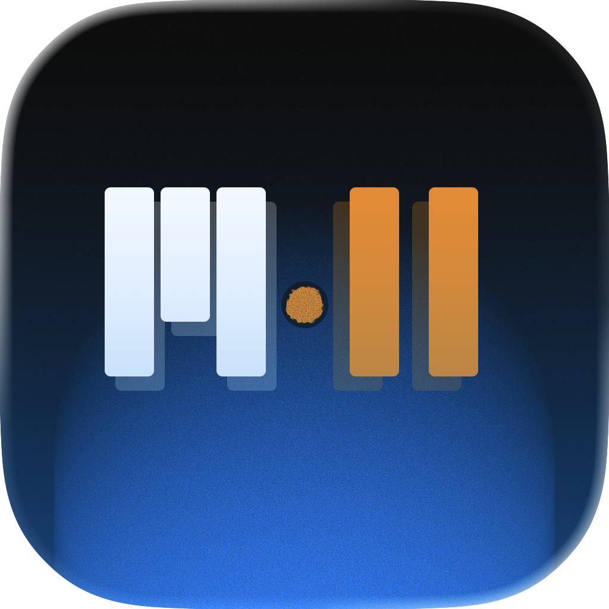
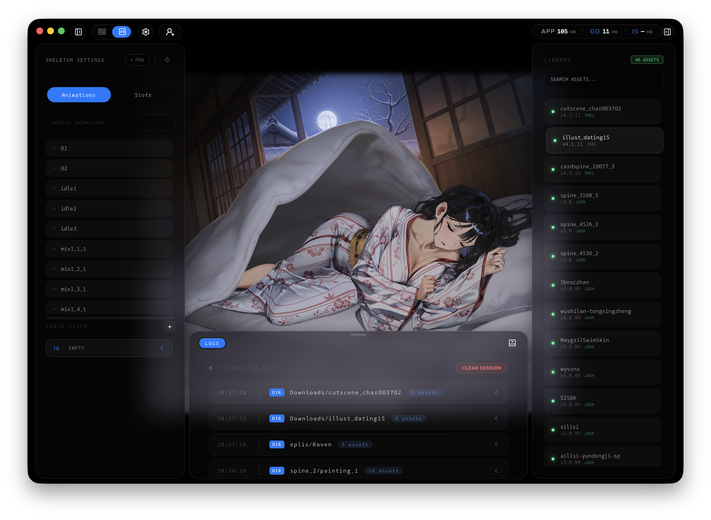
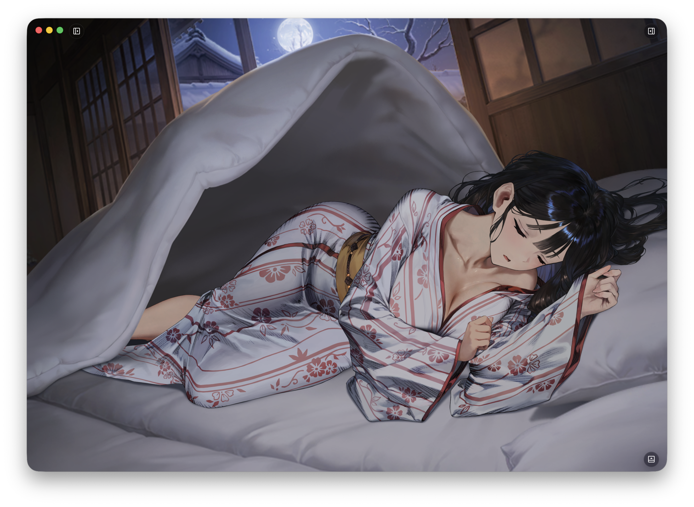
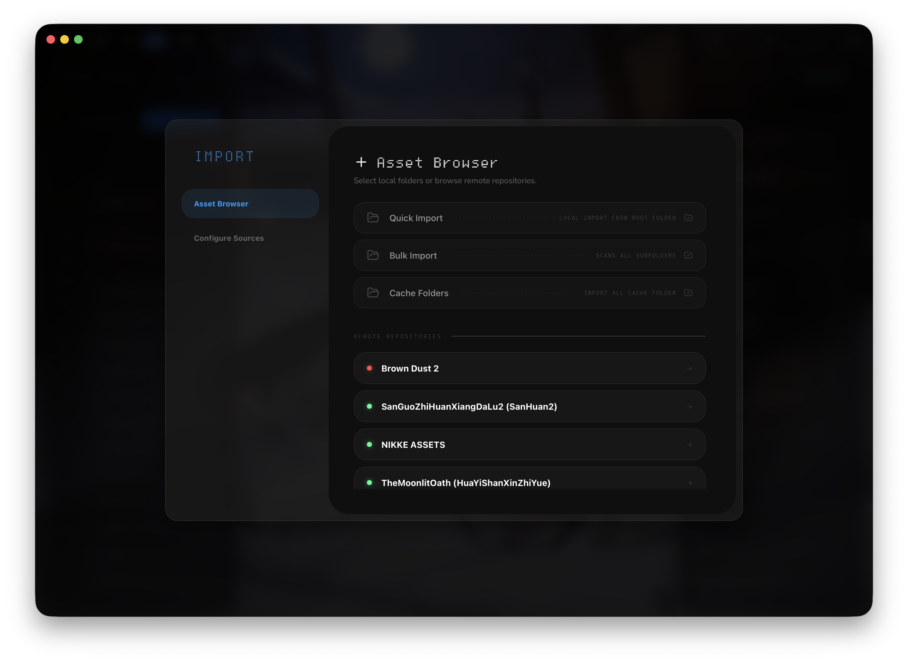
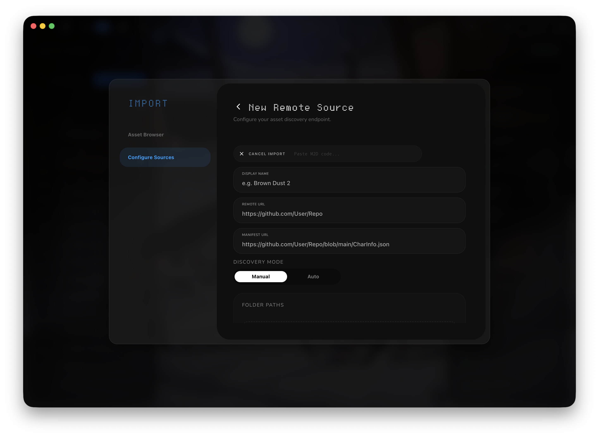

<p align="center">
  
</p>

<h1 align="center">Motiv2D</h1>

<p align="center">
  Language:
  <a href="README.md">English</a> |
  <a href="README.zh.md">中文</a>
</p>

<p align="center"> <strong>High-Performance Spine Viewer</strong><br/> A tool for previewing, managing, and batch-importing Spine assets.<br/> Built for efficiency with Go, Wails, and Svelte. <br/> </p>

<p align="center">
  <a href="https://github.com/o0Nomar0o/Motiv2d/releases">
    
  </a>
  <a href="https://github.com/o0Nomar0o/Motiv2d/releases/latest">
    
  </a>
  <a href="https://github.com/o0Nomar0o/Motiv2d/blob/main/LICENSE">
    
  </a>
</p>

<p align="center">
  <a href="#features">Features</a> •
   <a href="#roadmap">Roadmap</a> •
  <a href="#tech-stack">Tech Stack</a> •
  <a href="#download">Download</a> •
  <a href="#development">Development</a>
</p>

<p align="center">
  
</p>
<p align="center">
  
</p>

---

## Features

### Tooling

- **Layer Eye-Dropper**: Select any part of an animation directly in the viewport to instantly identify its corresponding layer name.
- **Smart Detection**: Detects tampered/fake headers or junk data in `.skel` and removes them. Automatically identifies if a `.skel` file is actually formatted as JSON.
- **Layer Filtering**: Find exactly what you need with multiple search terms using the `||` (OR) operator (e.g., `sky || background`).
- **Bulk Layer Visibility**: Quickly hide or show all filtered results with a single click.


### Remote & Storage

- **Source Sharing**: Import and export remote storage configurations via shareable codes for quick imports. 
- **Metadata Caching**: When a repository is loaded, the app caches all asset paths locally. This index istypically ** 1MB**, for instant browsing without re-scanning the repo.
- **Hybrid Fetching (Rate-Limit Friendly)**: 
    - **GitHub API**: Used only for initial directory indexing.
    - **jsDelivr CDN**: All actual asset downloads (textures, skel, atlas) are routed through jsDelivr. This **bypasses GitHub's API rate limits**.
- **On-Demand Refresh**: Data is persistent. Use the manual refresh button to sync with the latest repository changes.
- **Persistent Local Storage**: Fetched assets are cached locally for performance, and downloaded assets remain in local storage permanently until manually deleted.


<p align="center">
  
</p>

#### Example Import Code

To import a source, copy the code below and paste it into the "Import Code" field in the App:

```Plaintext
M2D:eyJuIjoiQnJvd24gRHVzdCAyIiwicCI6Im8wTm9tYXIwby9Ccm93bi1EdXN0LTItQXNzZXQvbWFzdGVyIiwibSI6MCwiZiI6W10sInUiOiJodHRwczovL3Jhdy5naXRodWJ1c2VyY29udGVudC5jb20vbzBOb21hcjBvL0Jyb3duLUR1c3QtMi1Bc3NldC9tYXN0ZXIvQ2hhckluZm8uanNvbiJ9
```
<p align="center">
  
</p>

---

## Roadmap

### Asset Handling & Runtimes

- **Version Expansion**: Add support for **Spine 3.7** and the latest **4.2** runtimes.
- **Image Correction**: Implement auto-cropping for texture images to match `.atlas` dimensions, fixing weird meshes and errors.
- **Live2D Integration**: Implement a **Live2D Cubism** viewer for .moc3 assets

### Extractions

- **AssetStudioMod CLI Bridge**: Offload heavy asset extraction to a dedicated CLI bridge. This allows for safe extraction from massive game bundles without overloading the application's memory.

### Remote Crawler Expansion

- Support for **Google Drive**, **OneDrive**, and other cloud storages.

---

## Tech Stack

| Layer              | Technology                                                                        |
| ------------------ | --------------------------------------------------------------------------------- |
| **Framework**      | [Wails v2](https://wails.io/)                                                     |
| **Backend**        | [Go](https://go.dev/)                                                             |
| **Frontend**       | [Svelte](https://svelte.dev/) & TypeScript                                        |
| **Animation Libs** | [Spine Runtimes (Esoteric Software)](https://esotericsoftware.com/spine-runtimes) |

---

## Download

| Platform    | Status                                                                    |
| ----------- | ------------------------------------------------------------------------- |
| **macOS**   | [Download Latest Release](https://github.com/o0Nomar0o/Motiv2D/releases)  |
| **Windows** | [Download Latest Release](https://github.com/o0Nomar0o/Motiv2D/releases)  |

---

## Development

### Quick Start

**Prerequisites:** [Go 1.21+](https://go.dev/), [Node.js](https://nodejs.org/), [Wails CLI](https://wails.io/docs/gettingstarted/installation).

```bash
# Clone the repo
git clone https://github.com/o0Nomar0o/Motiv2D.git
cd Motiv2d

# Start development mode
wails dev
```

---

### Project Structure

```
Motiv2D/
├── frontend/               # Svelte + TypeScript
│   ├── src/
│   │   ├── components/     # Components
│   │   ├── lib/            # Spine Runtime Libraries
│   │   └── stores/         # App state (appStore.ts)
│   └── wailsjs/            # Auto-generated Go-to-TS bindings
├── macos/                  # macOS specifics
├── pkg/                    # Core Go Backend
│   ├── spine-services/     # Spine Logic 
│   │   ├── detector/       # Version & File type detection
│   │   └── remote/         # Crawler & Cache Handlers
│   ├── monitors/           # System & Performance monitoring
│   ├── services/           # App-level backend services
│   ├── theme/              # Theme
│   └── update/             # Update logic
└── main.go                 # App entry point & Wails configuration
```

---

## License

MIT License — see [LICENSE]([https://www.google.com/search?q=LICENSE](https://github.com/o0Nomar0o/Motiv2D/blob/main/LICENSE)) for details.

---

<p align="center"> Built with ❤️ for the Spine Community. </p>
